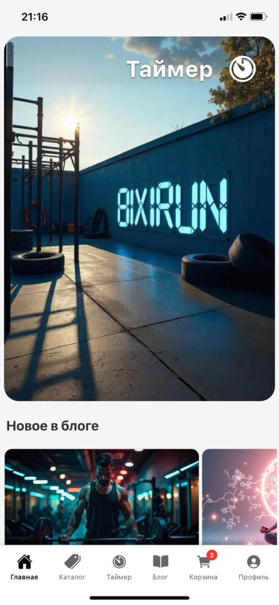

# BIXIRUN — витрина проекта

[](./LICENSE) [](https://docs.expo.dev/versions/latest/) [](https://reactnative.dev/) [](https://www.typescriptlang.org/) [](#поддерживаемые-платформы) [](https://kr1zal.github.io/BIXIRUN-showcase/)

[](https://github.com/kr1zal/BIXIRUN-showcase/stargazers) [](https://github.com/kr1zal/BIXIRUN-showcase/network/members) [](https://github.com/kr1zal/BIXIRUN-showcase/actions)

> Мобильное фитнес‑приложение на React Native/Expo: интервальные таймеры, тренировки, блог, магазин с корзиной и чекаутом, Supabase‑бэкенд.

[Презентационный репозиторий](https://github.com/kr1zal/BIXIRUN-showcase)

## Оглавление
- [О проекте](#о-проекте)
- [Технологии и стек](#технологии-и-стек)
- [Установка и запуск](#установка-и-запуск)
- [Структура проекта](#структура-проекта)
- [Возможности](#возможности)
- [Примеры использования](#примеры-использования)
- [FAQ](#faq)
- [Автор](#автор)
- [Лицензия](#-license)

## О проекте
BIXIRUN — приложение для интервальных тренировок и контроля прогресса. Поддерживает настраиваемые таймеры (рабочие/отдых), шаблоны тренировок, звуковые/тактильные сигналы, хранение пресетов и статистики в Supabase, контент‑раздел (блог) и витринный каталог товаров с корзиной и чекаутом.

Код основного приложения находится в приватном репозитории. Этот репозиторий — публичная витрина для ссылок, материалов и демо.

## Технологии и стек
- Клиент:
  - React 19, React Native 0.79, Expo 53, `expo-router` 5
  - Redux Toolkit 2 для состояния
  - `expo-image`, `react-native-reanimated`, `react-native-paper`
  - Звук/вибрация: `expo-av`, `expo-haptics`
  - Камера/медиа: `expo-camera`, `expo-media-library`, `react-native-vision-camera`
- Бэкенд:
  - Supabase (`@supabase/supabase-js` 2): аутентификация, БД, функции (Edge Functions)
- Инфраструктура и качество:
  - TypeScript 5.8, ESLint 9, GitHub Actions
- Платформы: iOS, Android, Web (Expo)

(Стек сформирован по package.json рабочего репозитория и внутренней документации.)

## Установка и запуск
Код — приватный. Доступ по запросу. Для локального запуска после получения доступа:
```bash
git clone git@github.com:kr1zal/BIXIRUN.git
cd BIXIRUN
npm install
# iOS/Android/Web
npm run ios
npm run android
npm run web
```
Требования: Xcode (iOS), Android SDK (Android), Node 18+, CocoaPods (iOS).

## Структура проекта
Ключевые директории основного приложения:
```
app/                # маршруты (expo-router), экраны: timer, workout, cart, profile, blog, legal
components/         # UI и функциональные компоненты (timer/*, ui/*, cart/*)
hooks/              # useTimer, useCart, usePrefetch, useAuthRedirect и др.
store/              # Redux Toolkit store и slices
utils/              # звук, haptics, storage, статистика, перфоманс
supabase/           # Edge Functions и конфиги
assets/             # шрифты, изображения, звуки
docs/               # техническая документация
```

## Возможности
- Таймеры: интервальный/рабочий‑отдых, визуализация прогресса, звуки/вибро
- Шаблоны тренировок и пресеты, синхронизация через Supabase
- Хранение пользовательской статистики
- Аутентификация (email/password), восстановление пароля
- Блог/контент‑раздел
- Каталог товаров, карточки, корзина, чекаут
- Оптимизации рендеринга: `expo-image`, мемоизация, оптимизация списков

## Примеры использования
- Запуск базового таймера: выбрать пресет, старт/пауза, автопереходы по интервалам
- Создание пресета: задать рабочее/отдых/повторы, сохранить (синк в Supabase)
- Покупки: выбрать товар → в корзину → чекаут

## FAQ
# Скриншоты


## Скриншоты

<table><tr><td align="center" width="50%"><br/><sub>Главный экран</sub></td><td align="center" width="50%"><br/><sub>Каталог</sub></td></tr><tr><td align="center" width="50%"><br/><sub>Карточка товара</sub></td><td align="center" width="50%"><br/><sub>Корзина/чекаут</sub></td></tr><tr><td align="center" width="50%"><br/><sub>Таймер пресеты</sub></td><td align="center" width="50%"><br/><sub>Видео-режим таймера</sub></td></tr><tr><td align="center" width="50%"><br/><sub>Статья в блоге</sub></td><td></td></tr></table>

## ENV (перечень без значений)
- SUPABASE_URL
- SUPABASE_ANON_KEY
- EXPO_PUBLIC_SUPABASE_URL
- EXPO_PUBLIC_SUPABASE_ANON_KEY
- SENTRY_DSN (если используется)

Поддерживаемые платформы: iOS 15+, Android 8+, Web (Expo Web).
