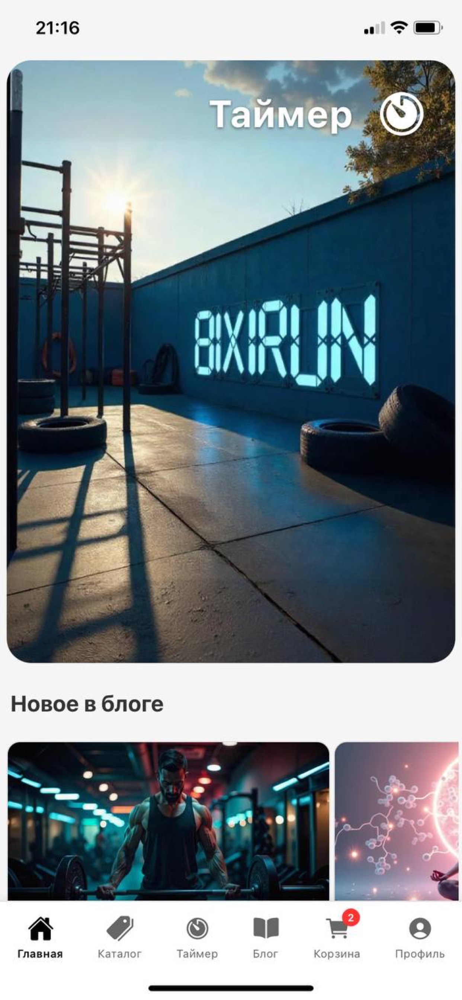
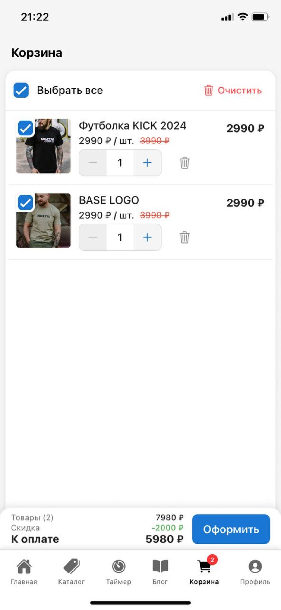
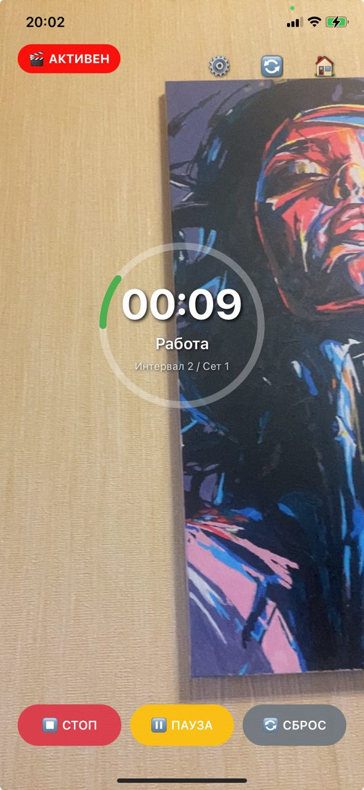

## BIXIRUN

Мобильное фитнес‑приложение на React Native/Expo: интервальные таймеры, тренировки, блог, магазин, Supabase.

[View on GitHub](https://github.com/kr1zal/BIXIRUN-showcase){: .btn .btn-primary }
[Live Demo](https://kr1zal.github.io/BIXIRUN-showcase/){: .btn }
[Request code access](https://github.com/kr1zal/BIXIRUN-showcase/issues/new?template=contact.yml){: .btn }

> Код проекта приватный; витрина — публичная. Доступ к коду по запросу.

## Быстрые ссылки
- README (этот репозиторий)
- Скриншоты (будут добавлены в `assets/images/`)
- Releases/демо (по мере готовности)

## Стек

## Скриншоты

  
 Главный экран

  
 Каталог товаров

  
 Карточка товара

  
 Корзина и оформление

  
 Таймер — пресеты

  
 Видео‑режим таймера

  
 Статья в блоге

## Навигация
- [README](../README.md)
- [Screens (ниже)](#скриншоты)
- [Лицензия](../LICENSE)
